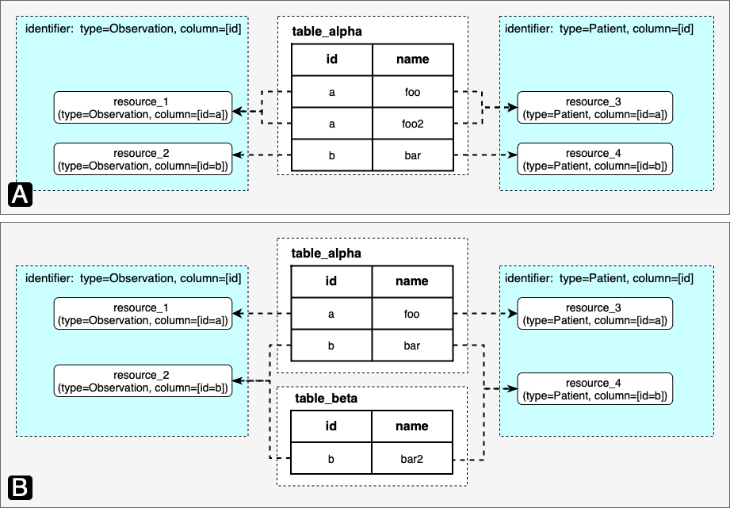
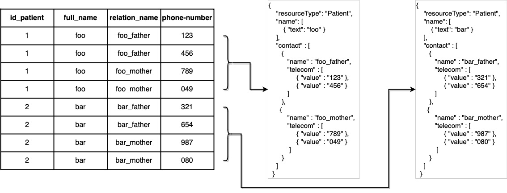
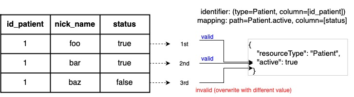
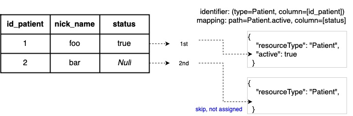
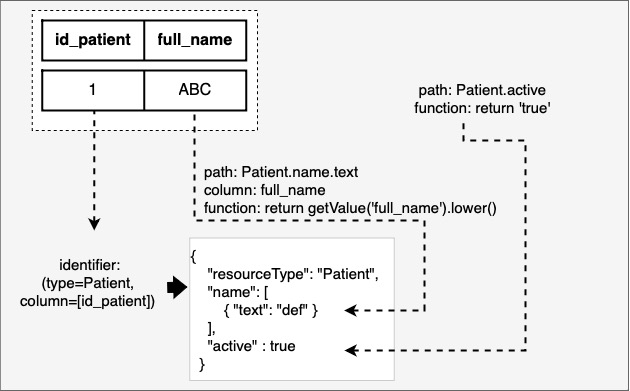
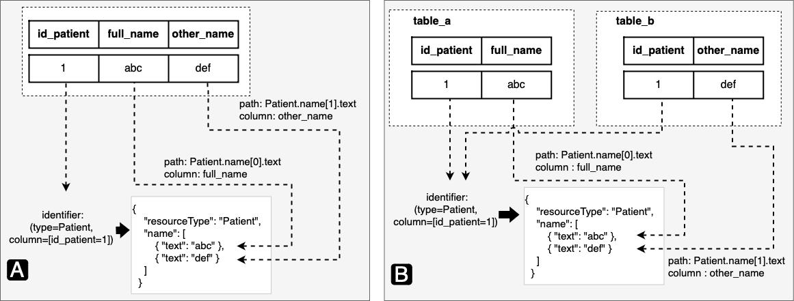
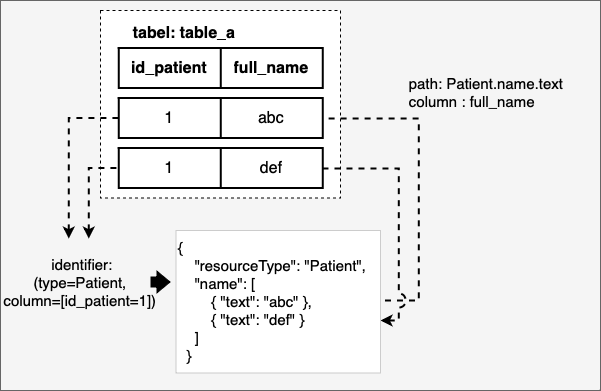

# RDB2FHIR

---

## What is RDB2FHIR?

RDB2FHIR stands for *Relational Database To Fast Healthcare Interoperability Resources* (FHIR). 
RDB2FHIR uses a mapping language, known as [**RDB2OL**](#rdb2ol), to generates FHIR resources from a relational database.
The current version of FHIR it supports is 4.0.1. The supported RDBMS are PostgreSQL and MySQL.
Data sources such as CSV and text files are also supported.
Refer to [**advanced usage**](#integration-with-other-rdbms) to find out how to use it with other RDBMS or Java data structures.
  

  

All you need to do is set up your mapping through  [**RDB2OL**](#rdb2ol) before passing it to RDB2FHIR.

---

## Help and Support
For questions and support please use [telegram](https://t.me/kalussajan). 
The issue tracker is for bug reports and feature discussions only.

---

## Minimum System Requirements
- Java version 17

___

## Usage

RDB2FHIR can be used either by importing it as a library for your project or running the executable jar.
First, you need to [compile the source code](#compiling-rdb2fhir) or download the compiled version [here](https://github.com/wawanmadda/rdb2fhir-core/releases) if you intend to run RD2FHIR as an executable jar.


```
Usage: java -jar rdb2fhir.jar [-hV] [-f=FORMAT] [-P=PASSWORD]
                              -s=DATA_SOURCE_SYSTEM -u=URL/PATH [-U=USER]
                              <RDB2OL path> <output path>
A tool to generate FHIR resources from a relational database
      <RDB2OL path>     path to mapping file (RDB2OL)
      <output path>     path to generated FHIR resources
  -f, --format=FORMAT   FHIR Output Format: JSON (default), XML, or RDF
  -h, --help            Show this help message and exit.
  -P, --pass=PASSWORD   Data Source password (default: empty string)
  -s, --source=DATA_SOURCE_SYSTEM
                        POSTGRESQL, MYSQL, or CSV
  -u, --url=URL/PATH    Data Source URL/Path
  -U, --user=USER       Data Source user (default: empty string)
  -V, --version         Print version information and exit.

```

For example:
```shell
% java -jar rdb2fhir.jar --db=POSTGRESQL --format=JSON --user=postgres --pass=postgres --url=localhost:5432/postgres /path/to/rdb2ol.json /path/to/output
```

For CSV or text files, you would provide the path to the folder containing the CSV or text files to `--url`:
```shell
% java -jar rdb2fhir.jar --db=CSV --format=JSON --url=/path/to/csv/folder /path/to/rdb2ol.json /path/to/output
```
For txt or other file extensions, you also need to provide the file extension with the argument
```shell
% java -jar rdb2fhir.jar --db=CSV --format=JSON --url=/path/to/csv/folder?separator=;&fileExtension=.txt /path/to/rdb2ol.json /path/to/output
```
___

## Test Suite

RDB2FHIR was validated against the FHIR R4 Examples and the US Core Profile Examples.
The idea involved saving the examples to a relational database and generating their RDB2OL.
The database and the RDB2OL were then used as inputs for RDB2FHIR to generate FHIR resources.
The generated FHIR resources were compared to the original examples.
The examples were considered to have passed the test if the comparison was equal.  

To run the test suite for the FHIR R4 Examples, type:
```shell
mvn test -Dtest=org.bayisehat.rdb2fhir.core.example.suite.R4MixTestSuite
```
To run the test suite for the US Core Examples, type:
```shell
mvn test -Dtest=org.bayisehat.rdb2fhir.core.example.suite.USMixTestSuite
```
By default, these test suites utilize an in-memory H2 database. This means that the test data is stored in the memory of your computer rather than in a more permanent form of storage, like a RDBMS.
If you'd rather run these tests using a PostgreSQL or MySQL database, you will need to make some modifications to the test suite files. Specifically, you will need to modify three files:
- `BaseExampleTest.java`
- `USMixTestSuite.java`
- `R4MixTestSuite.java`  

In these files, you will need to change the database configuration settings to point to your PostgreSQL or MySQL database, instead of the default H2 database. This will typically involve changing the connection, username, and password to match your PostgreSQL or MySQL settings.
Remember to ensure that your database is set up and running before executing the test suites.

You can find the generated RDB2OL in [rdb2ol/](rdb2ol) folder and the generated database in [sql/](sql) folder.

___

## Compiling RDB2FHIR

To run RDB2FHIR as an executable JAR, you need to compile it first by following these steps:

1. Unpack your zip file in any directory you want. (Choose one that you can easily access from your command line).
2. Open a shell/terminal (or command prompt), and navigate to the directory where you have placed the unpacked files.
3. At the shell prompt type `mvn package`. This will compile RDB2FHIR. This might take a couple of minutes the first time as Maven will need to download several libraries. Therefore, ensure you have an active internet connection.
4. You can find the generated JAR file in the `target` folder.

Alternatively, you can download the compiled RDB2FHIR [here](https://github.com/wawanmadda/rdb2fhir-core/releases).

---

# RDB2OL

---

## What is RDB2OL?

RDB2OL stands for *Relational Databases To Object Language*.
RDB2OL conveys the mapping information needed by RDB2FHIR to generate FHIR Resources. 
It is written in JSON format. 

RD2BOL consists of 1 or more **Quadruple**. Each *quadruple* consists of 4 properties (hence the name *quadruple* means 4):

- [class](#class)
- [view](#view)
- [identifier](#identifier)
- [mapping](#mapping)

Here is the example of a RDB2OL that consists of 1 quadruple:
```js
[
  {
    "class": "Patient",
    "view": {
      "tableName": "a647870152_0"
    },
    "identifier": [
      {
        "path": "Patient",
        "column": ["_subject"]
      }
    ],
    "mapping": [
      {
        "path": "Patient.id",
        "column": ["a1"]
      },
      {
        "path": "Patient.name.text",
        "column": ["a2"]
      }
    ]
  }
]
```

### `class`

The `class` refers to the resource type or the URL of the `StructureDefinition`. 
It serves as the target resource type. 

### `view`

The `view` represents the source table, which can be either:
- `tableName` : the name of a table, or
- `query` : a valid SQL statement query.  

The table should **NOT CONTAIN** duplicated column names.

### `identifier`

A resource is uniquely identified using a resource type (`class`), one or more `column` and their cell values.  

`identifier` composed of:
- `path` : In most cases, this value is the same as the resource type.
- `column` : The columns that identifies resources. Mostly, these are the columns for primary keys.

### `mapping`

This property consists of one or more JSON objects, each consisting of:
- `path` (mandatory): [FHIRPath](#fhirpath) indicates the element to be mapped. 
  - source value (mandatory), which could either be `column` or `function` or both.
  - `column` : The value is obtained from the cell in the column,
  - `function` : The value is obtained from a Python script.  
  The script can be used to assign a constant value. For example,
    ```js
    [
        {
            "path" : "Patient.multipleBirthInteger",
            "function" : "return 2"
        }
    ]
    ```  
    Note: The script must return a value; if omitted, `None` is returned, which translates as `null`.  
    If both `column` and `function` provided,
    you can use the function `getValue()` in the Python script to get the value from the column. 
    You will need to pass the column name to the function.
    This is particularly useful in cases when value transformation is necessary. For example,
    ```js
    [
       {
            "path" : "Patient.name.text",
            "column" : ["column_a", "column_b"],
            "function" : "return getValue('column_a').upper() + ' ' + getValue('column_b')"
        }
    ]
    ```

---

# How are FHIR resources generated?

Understanding the process of FHIR resources generation is crucial to accurately predict the output of RDB2FHIR.
Here are some key aspects to consider:

## Resources are identified using [`identifier`](#identifier)
Notably, the identifier will not be serialized or appear in the generated resources.
  
To make this concept clearer, consider the following examples:  

Table `foo`  

| id  | first_name | last_name  |
|-----|------------|------------|
| 1   | John       | Cena       |
| 2   | John       | Hopkins    |
| 3   | Rey        | Mysterio   |

Table `bar`

| id | middle_name |
|----|-------------|
| 1  | Adriano     |
| 2  | Balotelli   |
| 4  | Messi       |

- Example 1: RDB2OL is composed of 1 quadruple.
A combination of the resource `Patient`, column `first_name` as resource identifiers will generate only `2` FHIR resources from the table `foo`.
This is because only two distinct values present in column `first_name`.
RDB2OL would look like:
    ```js
    [
        {
            "class" : "Patient",
            "view" : {
                "tableName" : "foo"
            }, 
            "identifier" : [
                {
                    "path" : "Patient",
                    "column" : ["first_name"]
                }     
            ],
            <!--mapping lines hidden-->
        } 
    ]
    ```
- Example 2: RDB2OL is composed of `1` quadruple.
A combination of the resource `Patient`, columns `first_name` and `last_name` as resource identifiers will generate `3` FHIR resources.
This is because there are `3` distinct combinations of values in column `first_name` and `last_name`.
RDB2OL would look like:
    ```js
    [
        {
            "class" : "Patient",
            "view" : {
                "tableName" : "foo"
            }, 
            "identifier" : [
                {
                    "path" : "Patient",
                    "column" : ["first_name", "last_name"]
                }     
            ],
            <!--mapping lines hidden-->
        } 
    ]
    ```
- Example 3: RDB2OL is composed of `2` quadruple.
  In each quadruple, a combination of the resource `Patient`, column `id` as resource identifiers will generate a total of `4` FHIR resources.
  This is because there are a total of `4` distinct values in column `id` in both tables.
  RDB2OL would look like:
    ```js
    [{
        "class" : "Patient",
        "view" : {
            "tableName" : "foo"
        }, 
        "identifier" : [
            {
                "path" : "Patient",
                "column" : ["id"]
            }     
        ],
        <!--mapping lines hidden-->
    },
    {
        "class" : "Patient",
        "view" : {
              "tableName" : "bar"
        }, 
        "identifier" : [
            {
                "path" : "Patient",
                "column" : ["id"]
            }     
        ],
        <!--mapping lines hidden-->
    }]
    ```
## The use of FHIRPath in RDB2OL

Mapping is performed by defining associations from columns (and/or Python scripts) to FHIR elements. 

A FHIR element is indicated by [FHIRPath](http://hl7.org/fhirpath/N1/). FHIRPath can be described in two ways:
1. Absolute FHIRPath: Here, the path is described from the root resource. For example,
    ```
    Patient.active
    Patient.name.given
    ```
2. In relative path, the path is described relative to the root. The FHIRPath above can also be written as:
    ```
    active
    name.given
    ```

Various Usage Cases:
- Choice Data Type: In an element of [choice data type](https://hl7.org/fhir/R4/formats.html#choice), the type must be specified.
For example,
  ```
  Patient.multipleBirthBoolean
  ```
  or 
  ```
  Patient.multipleBirth{boolean}
  ```
- `Resource` Type: In an element of type `Resource`, such as `contained`, the type must be provided inside curly braces.
For example:
  ```
  Patient.contained{Patient}.active
  ```
- Slice: FHIRPath may also contain slice
  ```
  Patient.extension:race.valueCode
  ```
- Primitive Data Type: In an element of [primitive data type](https://hl7.org/fhir/R4/datatypes.html#primitive),
you can indicate its subelement after the element. For example,
  ```
  Patient.name.text.extension.url
  ```
  This will be serialized into:
  ```js
  {
    "name" : [
        {
            "_text" : {
                "extension" : [
                    {"url" : "<value>"}
                ]
            }
        }
    ]
  }
  ```
- FHIRPath also provides the capability of referencing specific elements in a collection by using an index (0-based).
  ```
  Patient.name[0].given[0]
  Patient.contained{Patient}[2].active
  ```  
  
  - If FHIRPath contains multiple element of type collection, any elements after the first element will default to the zero-index value unless another specific index is given. 
    The following FHIRPaths are equivalent:
    ```
    Patient.name[2].given
    Patient.name[2].given.extension.url
    ```
    is equivalent to:
    ```
    Patient.name[2].given[0]
    Patient.name[2].given[0].extension[0].url
    ```
  - Omitting the index of an element may yield different results depending on the table rows. 
  See the usage [here](#value-assignment-to-elements-in-resources)
    ```
    Patient.name[0].given
    ```
    and 
    ```
    Patient.name[0].given[0]
    ```
    may yield different results/resources.

## Value assignment to elements in resources

Elements in the resource are assigned values obtained from the cells which are intersection between a row and the columns.
The value may also be returned from a Python script.  

- Values are assigned to elements on a row-by-row basis.   
This means all mappings within the current row get assigned before transitioning to the next row. 
This process can be visualized as follows:  
  
  

- Overwriting an existing value with the same value is valid.  
This characteristic can be particularly useful when combining with other mapping functions such as [`identifier`](#identifier)
to map data from a table that has a one-to-many-to-many relationship. 
The following example illustrates this concept:

  ```js
    [{
        "class" : "Patient",
        "view" : {
            "tableName" : "table_1"
        }, 
        "identifier" : [
            {
                "path" : "Patient",
                "column" : ["id_patient"]
            },
            {
                "path" : "Patient.contact",
                "column" : ["relation_name"]
            }        
        ],
        "mapping" : [
            {
                "path" : "name.text",
                "column" : ["full_name"]
            },
            {
                "path" : "contact.name.text",
                "column" : ["relation_name"]
            },
            {
                "path" : "contact.telecom.value",
                "column" : ["phone-number"]
            }        
        ]     
    }]
  ```   


- Overwriting an existing value with a different value is invalid.  
If an element already contains a value, attempts at overwriting that value with a different one will fail and trigger an exception.  
  
  

- `Null` value is skipped.  
If a null value is encountered during the assignment process, 
it is ignored and the assignment process moves to the next cells.
The following example illustrates this concept:  
  

- A value may also be returned from a Python script using [`function`](#mapping).  
The following example illustrates this concept:  
  
  **Important Notes on Working with Python Scripts in RDB2OL**: 
  - Value return: When working with Python scripts in RDB2OL, always ensure that your script returns a value explicitly.
  - Default value: If the Python script does not explicitly return a value, it will, by default, return a `Null` value. 
    In technical terms, Python's `None` is translated to a `Null` in Java/DB.
  - Accessing cell values: If you need to retrieve a cell value within the script, use the `getValue()` function. 
    This function should be called with the column name as an argument. 
    For example: `getValue('ColumnName')`  


- When dealing with an element of type collection, values can be mapped in two ways:
  - Specify the index:  
    This allows you to control where exactly the value will be inserted within the collection.
    The following example illustrates this concept:  

  - Omit the index:  
    If the index is omitted, the value will be appended to the end of the collection automatically. 
    This is a simple way to add new values to a collection without having to be concerned with the current length or the specific positioning of elements.  



___

# Advanced Usage
___

## Integration With Other RDBMS

### Executable Jar
By default, RDB2FHIR supports PostgreSQL and MySQL. However, if you want to use it with other RDBMS, 
you would need to follow these steps:
1. Search for the JDBC driver of your RDBMS in the Maven Repositories.
2. Add the JDBC adapter to `pom.xml`.
3. Create a new class and extends the interface `org.bayisehat.rdb2fhir.core.jdbc.IDriver`.
This interface contains two methods which you will need to override, `getJdbcDriver()` and `getJdbcUrl(String url)`;
4. Edit `Main.java` to include an enum item for the new driver in the `enum DATA_SOURCE_SYSTEM`.
5. Edit the method `getDriver()` in the class `org.bayisehat.rdb2fhir.core.jdbc.DriverFactory` and provide the factory for the created class in step 2.
6. [Compile the source code](#compiling-rdb2fhir).

### Library

Include the JDBC adapter within the `pom.xml`. 

---

## Importing RDB2FHIR to Your Project

Aside from using RDB2FHIR via command line, you can also import it as a library within your project. 
This method can provide you with greater flexibility in leveraging the functionalities of RDB2FHIR.  

What you need is create an instance of `org.bayisehat.rdb2fhir.core.RDB2FHIR` by calling method `getInstance()` in the class `org.bayisehat.rdb2fhir.core.RDB2FHIRFactory`.
```java
FhirContext fhirContext = FhirContext.forR4();
Conformance conformance = new Conformance(fhirContext);

ConnectionService connectionService = new ConnectionService("jdbcdriver", "jdbcurl", "username", "pass");
Fetchable databaseFetcher = new DatabaseFetcher(connectionService, new ResultQuadrupleFactory());

RDB2FHIR rdb2FHIR = RDB2FHIRFactory.getInstance(conformance, databaseFetcher, fhirContext);
```
`org.bayisehat.rdb2fhir.core.fhir.Conformance` **SHOULD** be created only once during the lifecycle of your project due to the resource-intensive.  
In the code above a database serves as the data source. You can provide access to a data source by providing JDBC driver, url, 
user name, and password to `ConncectionService` constructor.  

An `RDB2FHIR` object is then created by calling the method `getInstance()` in the class `RDB2FHIRFactory`. 
There are several versions of this method available. 
These additional methods will be explained later.

After creating the instance of `RDB2FHIR`, you can generate FHIR resources by passing the mapping language. 
By default, these resources are created in JSON format.
```java 
String rdb2ol = loadFromFile(...);
String generatedResources =  RDB2FHIR.transform(rdb2ol);
```

---

### Serializing in Different Format

You can generate FHIR resources in different format in two ways:
- by calling the method `setOutputFormat()`
  ```java
  rdb2FHIR.setOutputFormat(RDB2FHIR.OutputFormat.XML);
  ```
  Available format: `RDB2FHIR.OutputFormat.JSON`, `RDB2FHIR.OutputFormat.XML`, `RDB2FHIR.OutputFormat.RDF`  

- through `Serializer` constructor:
  ```java 
  IParser parser = fhirContext.NDJsonParser();
  Serializer serializer = new Serializer(parser);
  RDB2FHIR rdb2FHIR = RDB2FHIRFactory.getInstance(conformance, databaseFetcher, serializer, fhirContext);
  ```
  Available parser: `RDFParser`, `JsonParser`, `XmlParser`, `NDJsonParser`  
  You can also provide your own parser by implementing `IParser`  

The IParser object offered by `HAPI FHIR` allows for extensive customization of parsing behavior,
such as pretty printing (more human-readable output) and encoding configuration (excluding resource narratives,
versioned references for certain elements, etc). You can find out more about it [here](https://hapifhir.io/hapi-fhir/docs/model/parsers.html)
```java 
IParser parser = fhirContext.newJsonParser();
parser.setPrettyPrint(false);
parser.setStripVersionsFromReferences(true);
parser.setSuppressNarratives(false);
parser.setSummaryMode(true);
```

---

### Validate Resources

Resource validation is not enabled by default. 
However, you can enable validation to resources by calling method `enableValidator()`:
```java
rdb2FHIR.enableValidator();
```
By default, when you enable validation, the following chain will validate your resources:
1. `DefaultProfileValidationSupport` validates FHIR resources against the built-in FHIR core structure definitions, including both FHIR resource definitions (StructureDefinition resources) and FHIR built-in vocabulary (ValueSet and CodeSystem resources).
2. `CommonCodeSystemsTerminologyService`validates codes in CodeSystems that are not distributed with the FHIR specification because they are difficult to distribute but are commonly used in FHIR resources.
Such as `Countries (ISO 3166)` and `Unified Codes for Units of Measure (UCUM)`  

It is possible to add and chain another validation module by calling the method `addValidationSupport()` in class `CachingValidationSupportWrapper`. 
Multiple validation modules create a chain to sequentially check and validate the FHIR resources.

HAPI FHIR provides a range of built-in validation support modules which can be used.
To see available Validation Support Module, refer to [HAPI FHIR Validation Support Module](https://hapifhir.io/hapi-fhir/docs/validation/validation_support_modules.html)
```java
CachingValidationSupportWrapper cachingValidationSupportWrapper = new CachingValidationSupportWrapper(new ValidationSupportChain(), fhirContext);
cachingValidationSupportWrapper.addValidationSupport(conformance.getDefaultProfileValidationSupport());
cachingValidationSupportWrapper.addValidationSupport(new CommonCodeSystemsTerminologyService(fhirContext));
cachingValidationSupportWrapper.buildCache();
```
When making changes to the validation support chain by adding (`addValidationSupport()`) or removing (`removeValidationSupport()`) modules,
It's important to rebuild the cache using the method `buildCache()` to speed up the validation.  

After your `CachingValidationSupportWrapper` is properly configured and cached, you can provide it to the `ValidatorService` constructor.
RDB2FHIR object can be created using method `getInstance()` that accepts `ValidationService` as one of its parameters as follows:
```java
ValidatorService validatorService =  new ValidatorService(conformance,
        cachingValidationSupportWrapper);
RDB2FHIR rdb2fhir = RDB2FHIRFactory.getInstance(conformance, fetcher, fhirContext, new ObjectMapper(), serializer, validatorService);
```

## Running in Batch
You should be aware that the FHIR generation process will fit into your memory.
If the database size is huge, it may not fit into your memory.
However, RDB2FHIR **DOES NOT SUPPORT** FHIR resource generation in batch mode.

But there is a workaround for this using `query` in RDB2OL.  

Instead of using `tableName`
```js
[
        {
            "class" : "Patient",
            "view" : {
                "tableName" : "foo"
            }, 
            <!--some lines hidden-->
        } 
]
```
use `query`
```js
[
        {
            "class" : "Patient",
            "view" : {
                "query" : "select * from foo LIMIT 5,10"
            }, 
            <!--some lines hidden-->
        } 
]
```
In this example, the query generates FHIR resources for only the entries between rows 6 and 15 in the 'foo' table.

---

## Advanced Mapping

---

### Mapping to a Profile

Mapping can be performed directly to a specific `Profile` rather than the base  `StructureDefition`.
The advantages are:
  - Meta profile in a resource gets generated automatically.
  - If validation is enabled, the resource will be validated against the profile in addition to the default validation.  

In RDB2OL, provide the `URL` of the profile to the `class`:
```js
{
    "class" : "http://hl7.org.nz/fhir/StructureDefinition/NzPatient",
    <!--some lines hidden-->
} 
```
Next, you need to provide the profile to `Conformance` by calling method `addStructureDefinition()` before creating an instance of `RDB2FHIR`:
```java
String profile = loadFile("src/test/resources/structuredefinition/StructureDefinition-NzPractitioner.json");
StructureDefinition structureDefinition = (StructureDefinition) parser.parseResource(profile);
conformance.addStructureDefinition("new-group", structureDefinition);

RDB2FHIR rdb2FHIR = RDB2FHIRFactory.getInstance(conformance, databaseFetcher, fhirContext);
```
Alternatively, you can also load a package to `Conformance` by calling method `loadPackageFromPath()`:
```java
conformance.loadPackageFromPath("us-core", "src/test/resources/package/us-core.tgz")
```

The meta profile will then be added automatically to the generated resource:
```js
{
  "resourceType" : "Patient",
  "meta" : {
    "profile" : ["http://hl7.org.nz/fhir/StructureDefinition/NzPatient"]
  }
  <!-- -->
}
```
If needed, you can disable this behavior by calling method `disableAutoMetaProfile()` in class `Serializer`.