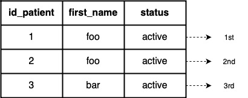

# RDB2FHIR

---

## What is RDB2FHIR?

RDB2FHIR stands for *Relational Database To Fast Healthcare Interoperability Resources* (FHIR). 
RDB2FHIR uses a mapping language, known as [**RDB2OL**](#rdb2ol), to generates FHIR resources from a relational database.
The current version of FHIR it supports is 4.0.1, and by default, it supports RDBMS such as PostgreSQL and MySQL.
Refer to [**advanced usage**](#rdb2ol) to find out how to use it with other RDBMS or formats like Excel, CSV, Java List/HashMap etc.
  

  

You only need to configure your mapping through [**RDB2OL**](#rdb2ol) before passing it to RDB2FHIR.

---

## Minimum System Requirements
- Java version 17

___

## Usage

RDB2FHIR can be used either by importing it as a library for your project or running the executable jar.
First, you need to [compile the source code](#compiling-rdb2fhir) or download the compiled version [here](https://github.com/wawanmadda/rdb2fhir-core/releases) if you intend to run RD2FHIR as an executable jar.


```
Usage: java -jar rdb2fhir.jar [-hV] d=RDBMS [-f=FORMAT] [-P=PASSWORD] -u=URL [-U=USER] <RDB2OL
path> <output path>
A tool to generate FHIR resources from a relational database
RDB2OL path       path to mapping file (RDB2OL)
output path       path to generated FHIR resources
d, --db=RDBMS     Relational Database Management System: POSTGRESQL, MYSQL
-f, --format=FORMAT   FHIR Output Format: JSON, XML, or RDF
-h, --help            Show this help message and exit.
-P, --pass=PASSWORD   Database password
-u, --url=URL         Database URL
-U, --user=USER       Database user
-V, --version         Print version information and exit.
```

For example:
```shell
% java -jar rdb2fhir.jar --db=POSTGRESQL --format=JSON --user=postgres --pass=postgres --url=localhost:5432/postgres /path/to/rdb2ol.json /path/to/output
```

___

## Test Suite

RDB2FHIR was validated against FHIR R4 Examples and US Core Profile Examples. 
The idea was saving the examples to a relational database and generating their RDB2OL. 
The database and the RDB2OL were used as inputs to RDB2FHIR to generate FHIR resources. 
The generated FHIR resources was compared to original Examples. 
The examples passed the test if the comparison is equal.  

To run the test suite for FHIR R4 Examples, type:
```shell
mvn test -Dtest=org.bayisehat.rdb2fhir.core.example.suite.R4MixTestSuite
```
To run the test suite for US Core Examples, type:
```shell
mvn test -Dtest=org.bayisehat.rdb2fhir.core.example.suite.USMixTestSuite
```
These test suites by default use in-memory database (H2). To run the tests using PostgreSQL/MYSQL,
modify the file `BaseExampleTest.java`, `USMixTestSuite.java`, and `R4MixTestSuite.java`. 

You can see the generated RDB2OL in folder [rdb2ol/](rdb2ol) and the generated database in folder [sql/](sql).

___

## Compiling RDB2FHIR

You need to compile RDB2FHIR to be able to execute it as an executable jar:

1. Unpack your zip file in whatever directory you want (use one that you can easily get to from your command line).
2. Open a shell/terminal (command prompt) and go to the directory where you put the unpacked files.
3. On the shell prompt type `mvn package`. This will compile RDB2FHIR. 
It may take a couple of minutes the first time because maven will download many libraries 
(you need an internet connection for this to work).

The compiled RDB2FHIR can also be downloaded [here](https://github.com/wawanmadda/rdb2fhir-core/releases).

---

# RDB2OL

---

## What is RDB2OL?

RDB2OL stands for *Relational Databases To Object Language*. 
RDB2OL conveys the mapping information needed by RDB2FHIR to generate FHIR Resources.
RDB2OL is written in JSON format.  

RD2BOL consists of 1 or more **Quadruple**. Each *quadruple* consists of 4 properties (hence the name *quadruple* means 4):

- [class](#class)
- [view](#view)
- [identifier](#identifier)
- [mapping](#mapping)

Here is the example of a RDB2OL which consists of 1 quadruple:
```js
[
  {
    "class": "Patient",
    "view": {
      "tableName": "a647870152_0"
    },
    "identifier": [
      {
        "path": "Patient",
        "column": ["_subject"]
      }
    ],
    "mapping": [
      {
        "path": "Patient.id",
        "column": ["a1"]
      },
      {
        "path": "Patient.name.text",
        "column": ["a2"]
      }
    ]
  }
]
```

### `class`

The `class` is the resource type or the URL of the `StructureDefinition`. 
`Class` acts as the resource type target.  

### `view`

The `view`. The source table which is one of:
- `tableName` : a table name, or 
- `query` : a valid SQL statement query.  

The table should **NOT CONTAIN** duplicated column names.

### `identifier`

A resource is uniquely identified using a resource type (`class`), one or more `column` and their values.  

`identifier` composed of:
- `path` : In most cases, the value is the same as the resource type.
- `column` : The columns that identifies resources. In most cases, it is the columns for primary keys.

### `mapping`

This property consists of one or more JSON objects, each consisting of:
- `path` (mandatory): [FHIRPath](#fhirpath) that indicate an element to be mapped. 
  - source value (mandatory), which is either `column` or `function` or both.
  - `column` : The value is obtained from the cell in the column,
  - `function` : The value is obtained from a Python script.  
  The script can be used to assign a constant value. For example,
    ```js
    [
        {
            "path" : "Patient.multipleBirthInteger",
            "function" : "return 2"
        }
    ]
    ```  
    Note: The script must return a value (`None` returned if omitted. `None` will be translated as `null`)  
    If both `column` and `function` provided, 
    you can get the value from the column in the Python script using function `getValue()` and passing the column name to the function.
    This is useful in cases when value transformation is needed. For example,
    ```js
    [
       {
            "path" : "Patient.name.text",
            "column" : ["column_a", "column_b"],
            "function" : "return getValue('column_a').upper() + ' ' + getValue('column_b')"
        }
    ]
    ```

---

# How does FHIR resources generated?

Understanding how FHIR resources are generated is crucial to predict the output. Some things to note include:

## Resources are identified using [`identifier`](#identifier)
A resource identifier is different from element `id` in a resource.  
The resource identifier will not be serialized or show up in the generated resources.
  
Let's take examples:  
Table `foo`  

| id  | first_name | last_name  |
|-----|------------|------------|
| 1   | John       | Cena       |
| 2   | John       | Hopkins    |
| 3   | Rey        | Mysterio   |

Table `bar`

| id | middle_name |
|----|-------------|
| 1  | Adriano     |
| 2  | Balotelli   |
| 4  | Messi       |

- Example 1: RDB2OL is composed of `1` quadruple.
A combination of resource `Patient`, column `first_name` set as resource identifiers will generate only `2` resources.
This is because only two distinct values in column `first_name`.
The RDB2OL will be:
    ```js
    [
        {
            "class" : "Patient",
            "view" : {
                "tableName" : "foo"
            }, 
            "identifier" : [
                {
                    "path" : "Patient",
                    "column" : ["first_name"]
                }     
            ],
            <!--mapping lines hidden-->
        } 
    ]
    ```
- Example 2: RDB2OL is composed of `1` quadruple.
A combination of resource `Patient`, columns `first_name` and `last_name` set as resource identifiers will generate `3` resources.
This is because there are `3` distinct combination of values in column `first_name` and `last_name`.
The RDB2OL will be:
    ```js
    [
        {
            "class" : "Patient",
            "view" : {
                "tableName" : "foo"
            }, 
            "identifier" : [
                {
                    "path" : "Patient",
                    "column" : ["first_name", "last_name"]
                }     
            ],
            <!--mapping lines hidden-->
        } 
    ]
    ```
- Example 3: RDB2OL is composed of `2` quadruple.
  In each quadruple, a combination of resource `Patient`, column `id` set as resource identifiers will generate a total of `4` resources.
  This is because there are a total of `4` distinct values in column `id` in both tables.
  The RDB2OL will be:
    ```js
    [{
        "class" : "Patient",
        "view" : {
            "tableName" : "foo"
        }, 
        "identifier" : [
            {
                "path" : "Patient",
                "column" : ["id"]
            }     
        ],
        <!--mapping lines hidden-->
    },
    {
        "class" : "Patient",
        "view" : {
              "tableName" : "bar"
        }, 
        "identifier" : [
            {
                "path" : "Patient",
                "column" : ["id"]
            }     
        ],
        <!--mapping lines hidden-->
    }]
    ```
## The use of FHIRPath in mapping

Mapping is performed by defining associations from columns (and/or Python script) to FHIR elements. 

A FHIR element is indicated by [FHIRPath](http://hl7.org/fhirpath/N1/).
- Absolute FHIRPath:
  ```
  Patient.active
  Patient.name.given
  ```
  In relative path, can also be written as:
  ```
  active
  name.given
  ```

- In an element of [choice data type](https://hl7.org/fhir/R4/formats.html#choice), the type must be specified
  ```
  Patient.multipleBirthBoolean
  ```
  or 
  ```
  Patient.multipleBirth{boolean}
  ```
- In an element of type `Resource`, such as `contained`, the type must be specified inside curly brace
  ```
  Patient.contained{Patient}.active
  ```
- In an element of [primitive data type](https://hl7.org/fhir/R4/datatypes.html#primitive), 
you can indicate its sub-element after the element. For example:
  ```
  Patient.name.text.extension.url
  ```
  Will be serialized into:
  ```js
  {
    "name" : [
        {
            "_text" : {
                "extension" : [
                    "url" : <value>
                ]
            }
        }
    ]
  }
  ```
- In an element of type collection, you may also specify the index.
  ```
  Patient.name[0].given[0]
  Patient.contained{Patient}[2].active
  ```  
  
  - If FHIRPath contain multiple element of type collection, elements after the first element is equivalent to zero index.
    ```
    Patient.name[0].given
    Patient.name[0].given.extension.url
    ```
    is equivalent to:
    ```
    Patient.name[0].given[0]
    Patient.name[0].given[0].extension[0].url
    ```
  - Omitting index of element may produce different result depending on the context.
    ```
    Patient.name[0].given
    ```
    and 
    ```
    Patient.name[0].given[0]
    ```
    may produce different result.
## Value assignment to elements in resources

Elements in the resource are assigned values obtained from the cells which are intersection between a row and the columns.
The value may also be returned from a Python script.  

- **Values are assigned to elements row by row. All mapping in current row are assigned before next row.**  
  
  

- Overwriting value with the same value is valid.  
  You could combine this with [`identifier`](#identifier) to map data in the table that has association one-to-many-to-many. 
For example:   

  ```js
    {
        "class" : "Patient",
        "view" : {
            "tableName" : "table_1"
        }, 
        "identifier" : [
            {
                "path" : "Patient",
                "column" : ["id_patient"]
            },
            {
                "path" : "Patient.contact",
                "column" : ["relation_name"]
            }        
        ],
        "mapping" : [
            {
                "path" : "name.text",
                "column" : ["full_name"]
            },
            {
                "path" : "contact.name.text",
                "column" : ["relation_name"]
            },
            {
                "path" : "contact.telecom.value",
                "column" : ["phone-number"]
            }        
        ]     
    }
  ```   


- If an element already contain a value, overwriting the value with different new value is invalid and throw exception.  
  
  

- `Null` value is skipped.  
  


- A value may also be returned from a Python script using [`function`](#mapping).  
  
**Note: A python script must return a value. By default, _Null_ value is returned (Python _None_ is translated to Java/DB _Null_)**  
To ge the cell value in the script, use function `getValue()` and passing the column name to the function.  


- You could map values to an element of type collection, by specifying the index:

  Or by omitting the index (values will be appended).
  Note: Use the same resource identifier to do this.


___

# Advanced Usage
___

## Integration With Other RDBMS

RDB2FHIR supports PostgreSQL and MySQL by default. To use it with other RDBMS:
1. Search for JDBC adapter of your RDBMS in maven repository.
2. Add the JDBC adapter to `pom.xml`.
3. [Compile the source code](#compiling-rdb2fhir).